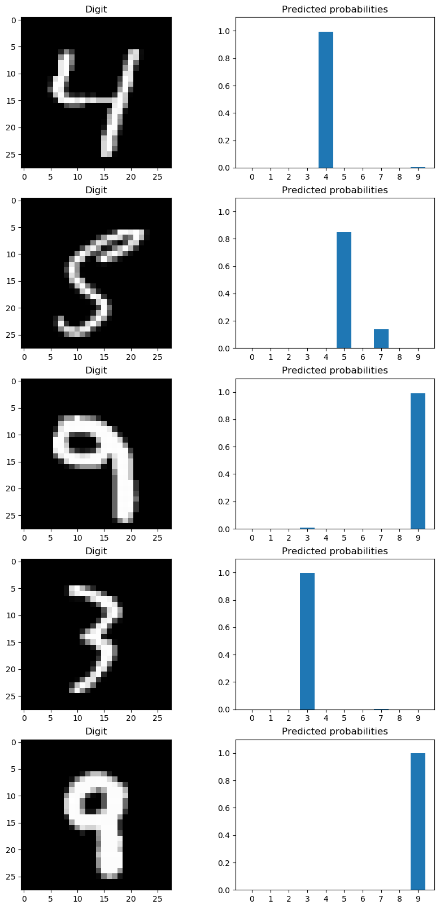
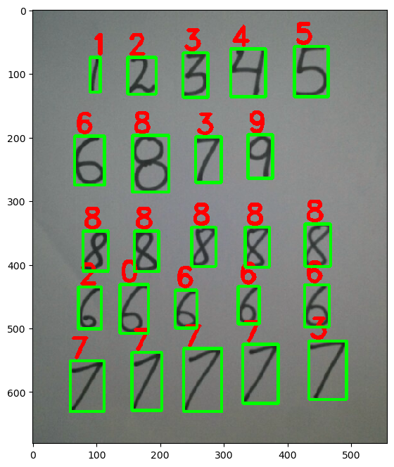

# Deep neural network for digit recognition

Training a deep neural network to recognize digits using the MNIST dataset. The trained neural network is then combined with opencv to find and recognize digits in a photo.

